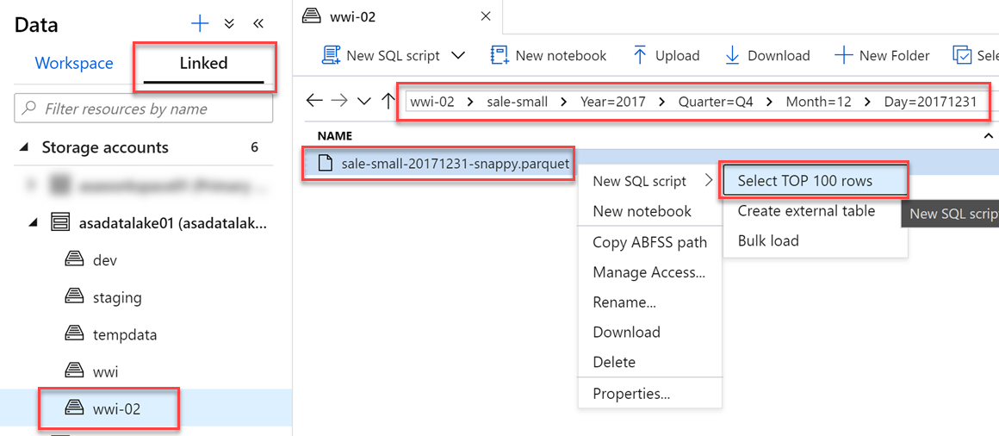
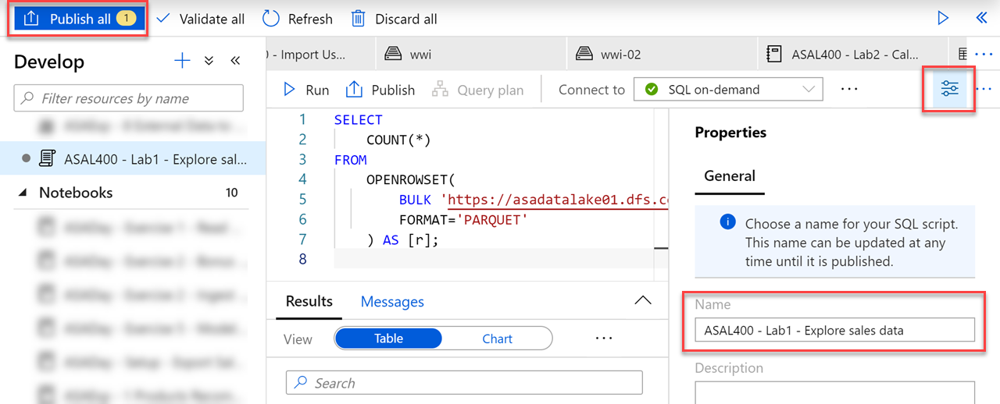
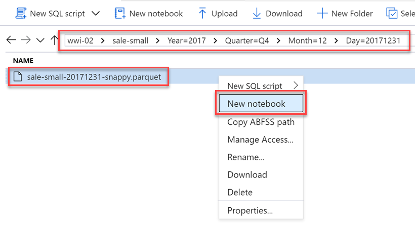
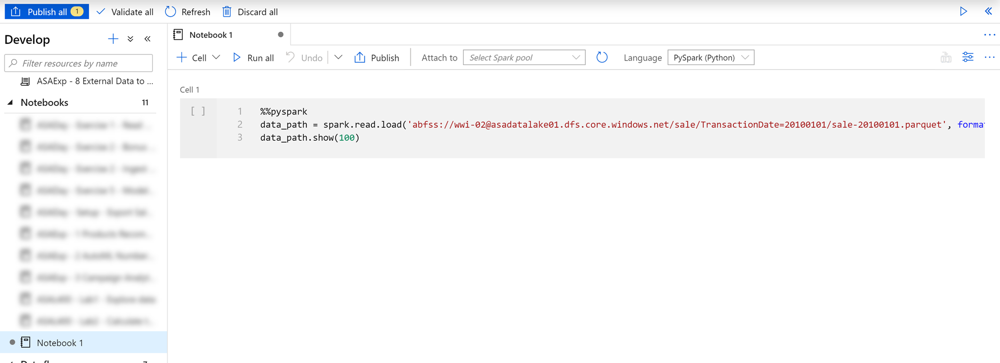

# Data Integration Part 1

- [Data Integration Part 1](#data-integration-part-1)
  - [Exercise 1: Explore source data in the Data Hub](#exercise-1-explore-source-data-in-the-data-hub)
    - [Task 1: Create linked service](#task-1-create-linked-service)
    - [Task 2: Create datasets](#task-2-create-datasets)
  - [Exercise 2: Explore source data in the Data hub](#exercise-2-explore-source-data-in-the-data-hub)
    - [Task 1: Query sales Parquet data with SQL Serverless](#task-1-query-sales-parquet-data-with-sql-serverless)
    - [Task 2: Query sales Parquet data with Azure Synapse Spark](#task-2-query-sales-parquet-data-with-azure-synapse-spark)
    - [Task 3: Query user profile JSON data with Azure Synapse Spark](#task-3-query-user-profile-json-data-with-azure-synapse-spark)
  - [Exercise 3: Create data pipeline to copy a month of customer data](#exercise-3-create-data-pipeline-to-copy-a-month-of-customer-data)
  - [Exercise 4: Create custom integration runtime](#exercise-4-create-custom-integration-runtime)
  - [Exercise 5: Update data pipeline with new integration runtime](#exercise-5-update-data-pipeline-with-new-integration-runtime)

```
Integrating Data Sources
Using Data Hub: Preview blob & DB data, T-SQL (On-Demand) and PySpark DataFrame
Orchestrate Hub: Connectors, Copy data

Studio - Manage Hub
Studio - Linked services
Studio - Integration runtimes

Large IR (32 cores) speed test:
    - General: 6:45
    - Memory: 3:29
    - Compute: 3:23
```

## Exercise 1: Explore source data in the Data Hub

### Task 1: Create linked service

Our data sources for labs 1 and 2 include files stored in ADLS Gen2 and Azure Cosmos DB. The linked service for ADLS Gen2 already exists as it is the primary ADLS Gen2 account for the workspace.

1. Open Synapse Analytics Studio, and then navigate to the **Manage** hub. Open **Linked services** and create a new linked service to the Azure Cosmos DB account for the lab. Name the linked service after the name of the Azure Cosmos DB account and set the **Database name** value to `CustomerProfile`.

    

### Task 2: Create datasets

1. Navigate to the **Data** hub. Create a new **Azure Cosmos DB (SQL API)** dataset with the following characteristics:

    - **Name**: Enter `asal400_customerprofile_cosmosdb`.
    - **Linked service**: Select the Azure Cosmos DB linked service.
    - **Collection**: Select `OnlineUserProfile01`.

    

2. Create a new **Azure Data Lake Storage Gen2** dataset with the **Parquet** format type with the following characteristics:

    - **Name**: Enter `asal400_sales_adlsgen2`.
    - **Linked service**: Select the `asadatalake01` linked service.
    - **File path**: Browse to the `wwi-02/sale` path.
    - **Import schema**: Select `From connection/store`.

    

3. Create a new **Azure Data Lake Storage Gen2** dataset with the **JSON** format type with the following characteristics:

    - **Name**: Enter `asal400_ecommerce_userprofiles_source`.
    - **Linked service**: Select the `asadatalake01` linked service.
    - **File path**: Browse to the `wwi-02/online-user-profiles-02` path.
    - **Import schema**: Select `From connection/store`.

## Exercise 2: Explore source data in the Data hub

Understanding data through data exploration is one of the core challenges faced today by data engineers and data scientists as well. Depending on the underlying structure of the data as well as the specific requirements of the exploration process, different data processing engines will offer varying degrees of performance, complexity, and flexibility.

In Azure Synapse Analytics, you have the possibility of using either the SQL Serverless engine, the big-data Spark engine, or both.

In this exercise, you will explore the data lake using both options.

### Task 1: Query sales Parquet data with SQL Serverless

When you query Parquet files using SQL Serverless, you can explore the data with T-SQL syntax.

1. In Synapse Analytics Studio, navigate to the **Data** hub.

    

2. Expand **Storage accounts**. Expand the `asadatalake01` primary ADLS Gen2 account and select `wwi-02`.

3. Navigate to the `wwi-02/sale/TransactionDate=20100102` folder. Right-click on the `sale-20100102.parquet` file, select **New SQL script**, then **Select TOP 100 rows**.

    

4. Ensure the **SQL on-demand** pool is selected in the `Connect to` dropdown list above the query window, then run the query. Data is loaded by the on-demand SQL pool and processed as if was coming from any regular relational database.

    

5. Modify the SQL query to perform aggregates and grouping operations to better understand the data. Replace the query with the following, making sure that the file path in `OPENROWSET` matches your current file path:

    ```sql
    SELECT
        TransactionDate, ProductId,
        SUM(ProfitAmount) AS [(sum)ProfitAmount],
        ROUND(AVG(Quantity),4) AS [(avg)Quantity],
        SUM(Quantity) AS [(sum)Quantity]
    FROM
        OPENROWSET(
            BULK 'https://asadatalake01.dfs.core.windows.net/wwi-02/sale/TransactionDate=20100102/sale-20100102.parquet',
            FORMAT='PARQUET'
        ) AS [r] GROUP BY r.TransactionDate, r.ProductId;
    ```

    

6. Now let's figure out how many records are contained within the Parquet files. This information is important for planning how we optimize for importing the data into Azure Synapse Analytics. To do this, replace your query with the following:

    ```sql
    SELECT
        COUNT(*)
    FROM
        OPENROWSET(
            BULK 'https://asadatalake01.dfs.core.windows.net/wwi-02/sale/*/*',
            FORMAT='PARQUET'
        ) AS [r];
    ```

    > Notice how we updated the path to include all Parquet files in all subfolders of `sales`.

Optional: If you wish to keep this SQL script for future reference, select the Properties button, provide a descriptive name, such as `ASAL400 - Lab1 - Explore sales data`, then select **Publish all**.



**TODO**: Update to show the total count of records once all data is available in the environment.

### Task 2: Query sales Parquet data with Azure Synapse Spark

1. Navigate to the **Data** hub, browse to the data lake storage account folder `wwi-02/sale/TransactionDate=20100101`, then right-click the Parquet file and select New notebook.

    

2. This will generate a notebook with PySpark code to load the data in a dataframe and display 100 rows with the header.

    

3. Attach the notebook to a Spark pool.

    

4. Select **Run all** on the notebook toolbar to execute the notebook.

    > **Note:** The first time you run a notebook in a Spark pool, Synapse creates a new session. This can take approximately 3 minutes.

5. As you can see, the output is not formatted very well. To change this, replace the last line of code with the following and run the cell again to see the improved display:

    ```python
    display(data_path.limit(100))
    ```

    

6. Create a new cell underneath by selecting **{} Add code** when hovering over the blank space at the bottom of the notebook.

    

7. The Spark engine can analyze the Parquet files and infer the schema. To do this, enter the following in the new cell:

    ```python
    data_path.printSchema()
    ```

    Your output should look like the following:

    ```text
    root
     |-- TransactionId: string (nullable = true)
     |-- CustomerId: integer (nullable = true)
     |-- ProductId: short (nullable = true)
     |-- Quantity: short (nullable = true)
     |-- Price: decimal(29,2) (nullable = true)
     |-- TotalAmount: decimal(29,2) (nullable = true)
     |-- TransactionDate: integer (nullable = true)
     |-- ProfitAmount: decimal(29,2) (nullable = true)
     |-- Hour: byte (nullable = true)
     |-- Minute: byte (nullable = true)
     |-- StoreId: short (nullable = true)
    ```

8. Now let's use the dataframe to perform the same grouping and aggregate query we performed with the SQL Serverless pool. Create a new cell and enter the following:

    ```python
    from pyspark.sql import SparkSession
    from pyspark.sql.types import *
    from pyspark.sql.functions import *

    profitByDateProduct = (data_path.groupBy("TransactionDate","ProductId")
        .agg(
            sum("ProfitAmount").alias("(sum)ProfitAmount"),
            round(avg("Quantity"), 4).alias("(avg)Quantity"),
            sum("Quantity").alias("(sum)Quantity"))
        .orderBy("TransactionDate"))
    display(profitByDateProduct.limit(100))
    ```

    > We import required Python libraries to use aggregation functions and types defined in the schema to successfully execute the query.

### Task 3: Query user profile JSON data with Azure Synapse Spark

## Exercise 3: Create data pipeline to copy a month of customer data

## Exercise 4: Create custom integration runtime

Go to code view and set the timeToLive value to 60. Discuss what this means as far as cost, etc.
Set the concurrency on the pipeline to a higher number. Default value if unset is 4.

## Exercise 5: Update data pipeline with new integration runtime

Compare importing with PolyBase to importing with COPY command

Compare importing into a clustered table vs. a heap table, then use a select into command to move from the heap to clustered table