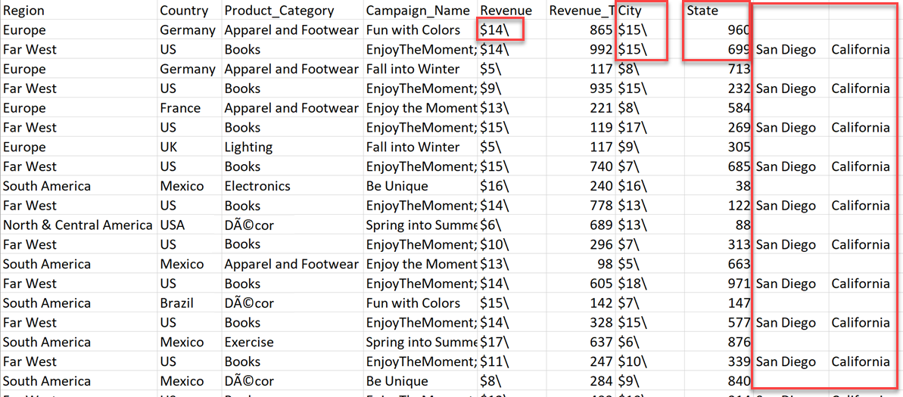
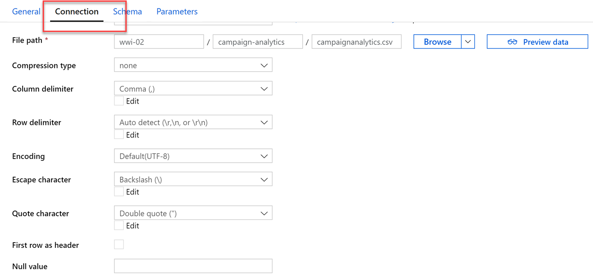
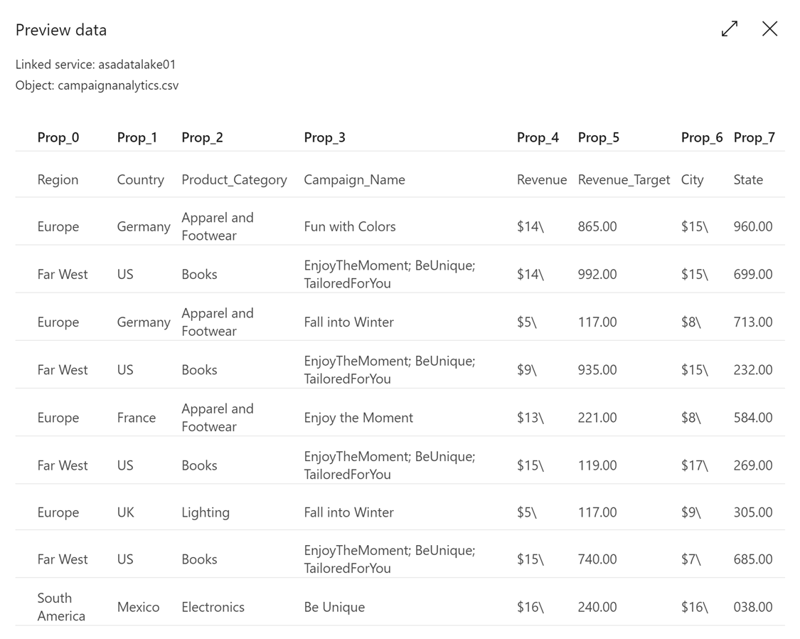

# Data Integration Part 2

- [Data Integration Part 2](#data-integration-part-2)
  - [Resource naming throughout this lab](#resource-naming-throughout-this-lab)
  - [Exercise 1: Create datasets and SQL tables](#exercise-1-create-datasets-and-sql-tables)
    - [Task 1: Create SQL tables](#task-1-create-sql-tables)
    - [Task 2: Create datasets](#task-2-create-datasets)
  - [Exercise 2: Create data flow to import poorly formatted CSV](#exercise-2-create-data-flow-to-import-poorly-formatted-csv)
  - [Exercise 3: Create data flow to join disparate data sources](#exercise-3-create-data-flow-to-join-disparate-data-sources)
  - [Exercise 4: Create pipeline trigger window to import remaining Parquet data](#exercise-4-create-pipeline-trigger-window-to-import-remaining-parquet-data)
  - [Exercise 5: Create Synapse Spark notebook to find top products](#exercise-5-create-synapse-spark-notebook-to-find-top-products)

```
Create e2e pipeline for initial load & update
Data Prep: Handle bad data, file formats, join disparate sources
Troubleshoot: pipeline/activity failure (something beyond simply looking at the portal)
Optimize: trigger window, exec time

Triggering Pipelines
Creating schedule, tumbling window, event (blob vs ADLS)
Other cases: trigger via Function
    - Native and non-standard ways to trigger a pipeline
    - Set up change feed-triggered function (CSharp script via portal). Edit a document in Cosmos DB (maybe a pipeline parameter), which triggers the function
    - Maybe trigger the pipeline via REST call and shown here: https://github.com/solliancenet/azure-synapse-analytics/blob/master/infrastructure/asaexp/setup/ASAExp%20-%20Import%20SQL%20Pool%20Tables.ps1#L114

Spark notebook to connect to the wwi.UserTopProductPurchases Synapse database table.
    - Have user right-click the table, choose notebook, then new Spark notebook
    - Execute code to find the top 5 products for each user, based on which ones are both preferred and top, and have the most purchases in past 12 months
    - Top 5 products overall

```

## Resource naming throughout this lab

For the remainder of this guide, the following terms will be used for various ASA-related resources (make sure you replace them with actual names and values):

| Azure Synapse Analytics Resource  | To be referred to |
| --- | --- |
| Workspace resource group | `WorkspaceResourceGroup` |
| Workspace / workspace name | `Workspace` |
| Primary Storage Account | `PrimaryStorage` |
| Default file system container | `DefaultFileSystem` |
| SQL Pool | `SqlPool01` |

## Exercise 1: Create datasets and SQL tables

### Task 1: Create SQL tables

1. Open Synapse Analytics Studio, and then navigate to the **Develop** hub.

    

2. From the **Develop** menu, select the + button and choose **SQL Script** from the context menu.

    

3. In the toolbar menu, connect to the database on which you want to execute the query.

    

4. In the query window, replace the script with the following to create a new table for the Campaign Analytics CSV file:

    ```sql
    CREATE TABLE [wwi].[CampaignAnalytics]
    (
        [Region] [nvarchar](50)  NOT NULL,
        [Country] [nvarchar](30)  NOT NULL,
        [ProductCategory] [nvarchar](50)  NOT NULL,
        [CampaignName] [nvarchar](500)  NOT NULL,
        [Revenue] [decimal](10,2)  NULL,
        [RevenueTarget] [decimal](10,2)  NULL,
        [City] [nvarchar](50)  NULL,
        [State] [nvarchar](25)  NULL
    )
    WITH
    (
        DISTRIBUTION = HASH ( [Region] ),
        CLUSTERED COLUMNSTORE INDEX
    )
    ```

5. Select **Run** from the toolbar menu to execute the SQL command.

    

6. In the query window, replace the script with the following to create a new table for the Sales Parquet files:

    ```sql
    CREATE TABLE [wwi].[Sale]
    (
        [TransactionId] [uniqueidentifier]  NOT NULL,
        [CustomerId] [int]  NOT NULL,
        [ProductId] [smallint]  NOT NULL,
        [Quantity] [smallint]  NOT NULL,
        [Price] [decimal](9,2)  NOT NULL,
        [TotalAmount] [decimal](9,2)  NOT NULL,
        [TransactionDate] [int]  NOT NULL,
        [ProfitAmount] [decimal](9,2)  NOT NULL,
        [Hour] [tinyint]  NOT NULL,
        [Minute] [tinyint]  NOT NULL,
        [StoreId] [smallint]  NOT NULL
    )
    WITH
    (
        DISTRIBUTION = HASH ( [CustomerId] ),
        CLUSTERED COLUMNSTORE INDEX,
        PARTITION
        (
            [TransactionDate] RANGE RIGHT FOR VALUES (20100101, 20100201, 20100301, 20100401, 20100501, 20100601, 20100701, 20100801, 20100901, 20101001, 20101101, 20101201, 20110101, 20110201, 20110301, 20110401, 20110501, 20110601, 20110701, 20110801, 20110901, 20111001, 20111101, 20111201, 20120101, 20120201, 20120301, 20120401, 20120501, 20120601, 20120701, 20120801, 20120901, 20121001, 20121101, 20121201, 20130101, 20130201, 20130301, 20130401, 20130501, 20130601, 20130701, 20130801, 20130901, 20131001, 20131101, 20131201, 20140101, 20140201, 20140301, 20140401, 20140501, 20140601, 20140701, 20140801, 20140901, 20141001, 20141101, 20141201, 20150101, 20150201, 20150301, 20150401, 20150501, 20150601, 20150701, 20150801, 20150901, 20151001, 20151101, 20151201, 20160101, 20160201, 20160301, 20160401, 20160501, 20160601, 20160701, 20160801, 20160901, 20161001, 20161101, 20161201, 20170101, 20170201, 20170301, 20170401, 20170501, 20170601, 20170701, 20170801, 20170901, 20171001, 20171101, 20171201, 20180101, 20180201, 20180301, 20180401, 20180501, 20180601, 20180701, 20180801, 20180901, 20181001, 20181101, 20181201, 20190101, 20190201, 20190301, 20190401, 20190501, 20190601, 20190701, 20190801, 20190901, 20191001, 20191101, 20191201)
        )
    )
    ```

7. Select **Run** from the toolbar menu to execute the SQL command.

8. In the query window, replace the script with the following to create a new table for the user reviews contained within the user profile data in Azure Cosmos DB:

    ```sql
    CREATE TABLE [wwi].[UserProductReviews]
    (
        [UserId] [int]  NOT NULL,
        [ProductId] [int]  NOT NULL,
        [ReviewText] [nvarchar](1000)  NOT NULL,
        [ReviewDate] [datetime]  NOT NULL
    )
    WITH
    (
        DISTRIBUTION = HASH ( [ProductId] ),
        CLUSTERED COLUMNSTORE INDEX
    )
    ```

9. Select **Run** from the toolbar menu to execute the SQL command.

10. In the query window, replace the script with the following to create a new table that joins users' preferred products stored in Azure Cosmos DB with top product purchases per user from the e-commerce site, stored in JSON files within the data lake:

    ```sql
    CREATE TABLE [wwi].[UserTopProductPurchases]
    ( 
        [UserId] [int]  NOT NULL,
        [ProductId] [int]  NOT NULL,
        [ItemsPurchasedLast12Months] [int]  NULL,
        [IsTopProduct] [bit]  NOT NULL,
        [IsPreferredProduct] [bit]  NOT NULL
    )
    WITH
    (
        DISTRIBUTION = HASH ( [UserId] ),
        CLUSTERED COLUMNSTORE INDEX
    )
    ```

11. Select **Run** from the toolbar menu to execute the SQL command.

### Task 2: Create datasets

Your organization was provided a poorly formatted CSV file containing marketing campaign data. The file was uploaded to the data lake and now it must be imported into the data warehouse.



Issues include invalid characters in some product categories, invalid characters in the revenue currency data, and misaligned columns.

1. Navigate to the **Data** hub.

    

2. Create a new **Azure Data Lake Storage Gen2** dataset with the **DelimitedText** format type with the following characteristics:

    - **Name**: Enter `asal400_campaign_analytics_source`.
    - **Linked service**: Select the `asadatalake01` linked service.
    - **File path**: Browse to the `wwi-02/campaign-analytics/campaignanalytics.csv` path.
    - **First row as header**: Leave `unchecked`. **We are skipping the header** because there is a mismatch between the number of columns in the header and the number of columns in the data rows.
    - **Import schema**: Select `From connection/store`.

    

3. After creating the dataset, navigate to its **Connection** tab. Leave the default settings. They should match the following configuration:

    - **Compression type**: Select `none`.
    - **Column delimiter**: Select `Comma (,)`.
    - **Row delimiter**: Select `Auto detect (\r,\n, or \r\n)`.
    - **Encoding**: Select `Default(UTF-8).
    - **Escape character**: Select `Backslash (\)`.
    - **Quote character**: Select `Double quote (")`.
    - **First row as header**: Leave `unchecked`.
    - **Null value**: Leave the field empty.

    

4. Select **Preview data**.

5. Preview data displays a sample of the CSV file. You can see some of the issues shown in the screenshot at the beginning of this task. Notice that since we are not setting the first row as the header, the header columns appear as the first row. Also, notice that the city and state values seen in the earlier screenshot do not appear. This is because of the mismatch in the number of columns in the header row compared to the rest of the file. We will exclude the first row when we create the data flow in the next exercise.

    

## Exercise 2: Create data flow to import poorly formatted CSV

## Exercise 3: Create data flow to join disparate data sources

## Exercise 4: Create pipeline trigger window to import remaining Parquet data

## Exercise 5: Create Synapse Spark notebook to find top products