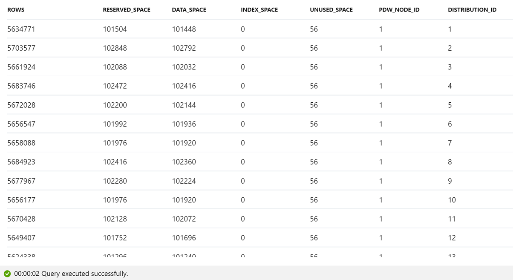
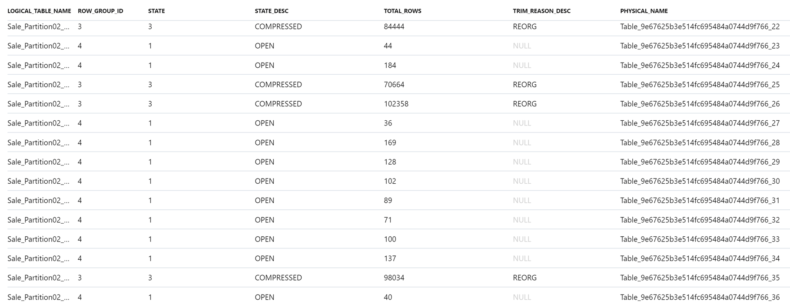

# DW Optimization Part 2

- [DW Optimization Part 2](#dw-optimization-part-2)
  - [Exercise 1 - Check for skewed data and space usage](#exercise-1---check-for-skewed-data-and-space-usage)
    - [Task 1 - Analyze the space used by tables](#task-1---analyze-the-space-used-by-tables)
    - [Task 2 - Use a more advanced approach to understand table space usage](#task-2---use-a-more-advanced-approach-to-understand-table-space-usage)
  - [Exercise 2 - Understand column store storage details](#exercise-2---understand-column-store-storage-details)
    - [Task 1 - Create view for column store row group stats](#task-1---create-view-for-column-store-row-group-stats)
    - [Task 2 - Explore column store storage details](#task-2---explore-column-store-storage-details)
  - [Exercise 3 - Study the impact of wrong choices for column data types](#exercise-3---study-the-impact-of-wrong-choices-for-column-data-types)
    - [Task 1 - Create and populate a table with optimal column data types](#task-1---create-and-populate-a-table-with-optimal-column-data-types)
    - [Task 2 - Create and populate a table with sub-optimal column data types](#task-2---create-and-populate-a-table-with-sub-optimal-column-data-types)
    - [Task 3 - Compare storage requirements](#task-3---compare-storage-requirements)
  - [Exercise 4 - Study the impact of materialized views](#exercise-4---study-the-impact-of-materialized-views)
    - [Task 1 - Analyze the execution plan of a query](#task-1---analyze-the-execution-plan-of-a-query)
    - [Task 2 - Improve the execution plan of the query with a materialized view](#task-2---improve-the-execution-plan-of-the-query-with-a-materialized-view)
  - [Exercise 5 - Avoid extensive logging](#exercise-5---avoid-extensive-logging)
    - [Task 1 - Rules for minimally logged operations](#task-1---rules-for-minimally-logged-operations)
    - [Task 2 - Optimizing a delete operation](#task-2---optimizing-a-delete-operation)
    - [Task 3 - Optimizing an update operation](#task-3---optimizing-an-update-operation)
    - [Task 4 - Optimizing operations with partition switching](#task-4---optimizing-operations-with-partition-switching)
  - [Exercise 6 - Correlate replication and distribution strategies across multiple tables](#exercise-6---correlate-replication-and-distribution-strategies-across-multiple-tables)
    - [Task 1 - Distribute lookup tables](#task-1---distribute-lookup-tables)
    - [Task 2 - Replicate lookup tables](#task-2---replicate-lookup-tables)

`<TBA>`
Explicit instructions on scaling up to DW1500 before the lab and scaling back after Lab 04 is completed.
`</TBA>`

## Exercise 1 - Check for skewed data and space usage

### Task 1 - Analyze the space used by tables

1. Run the following DBCC command:

    ```sql
    DBCC PDW_SHOWSPACEUSED('wwi_perf.Sale_Hash');
    ```

    

2. Analyze the number of rows in each distribution. Those numbers should be as even as possible.

### Task 2 - Use a more advanced approach to understand table space usage

1. Run the following script to create the `vTableSizes` view:

    ```sql
    CREATE VIEW [wwi_perf].[vTableSizes]
    AS
    WITH base
    AS
    (
    SELECT
    GETDATE()                                                             AS  [execution_time]
    , DB_NAME()                                                            AS  [database_name]
    , s.name                                                               AS  [schema_name]
    , t.name                                                               AS  [table_name]
    , QUOTENAME(s.name)+'.'+QUOTENAME(t.name)                              AS  [two_part_name]
    , nt.[name]                                                            AS  [node_table_name]
    , ROW_NUMBER() OVER(PARTITION BY nt.[name] ORDER BY (SELECT NULL))     AS  [node_table_name_seq]
    , tp.[distribution_policy_desc]                                        AS  [distribution_policy_name]
    , c.[name]                                                             AS  [distribution_column]
    , nt.[distribution_id]                                                 AS  [distribution_id]
    , i.[type]                                                             AS  [index_type]
    , i.[type_desc]                                                        AS  [index_type_desc]
    , nt.[pdw_node_id]                                                     AS  [pdw_node_id]
    , pn.[type]                                                            AS  [pdw_node_type]
    , pn.[name]                                                            AS  [pdw_node_name]
    , di.name                                                              AS  [dist_name]
    , di.position                                                          AS  [dist_position]
    , nps.[partition_number]                                               AS  [partition_nmbr]
    , nps.[reserved_page_count]                                            AS  [reserved_space_page_count]
    , nps.[reserved_page_count] - nps.[used_page_count]                    AS  [unused_space_page_count]
    , nps.[in_row_data_page_count]
        + nps.[row_overflow_used_page_count]
        + nps.[lob_used_page_count]                                        AS  [data_space_page_count]
    , nps.[reserved_page_count]
    - (nps.[reserved_page_count] - nps.[used_page_count])
    - ([in_row_data_page_count]
            + [row_overflow_used_page_count]+[lob_used_page_count])       AS  [index_space_page_count]
    , nps.[row_count]                                                      AS  [row_count]
    from
        sys.schemas s
    INNER JOIN sys.tables t
        ON s.[schema_id] = t.[schema_id]
    INNER JOIN sys.indexes i
        ON  t.[object_id] = i.[object_id]
        AND i.[index_id] <= 1
    INNER JOIN sys.pdw_table_distribution_properties tp
        ON t.[object_id] = tp.[object_id]
    INNER JOIN sys.pdw_table_mappings tm
        ON t.[object_id] = tm.[object_id]
    INNER JOIN sys.pdw_nodes_tables nt
        ON tm.[physical_name] = nt.[name]
    INNER JOIN sys.dm_pdw_nodes pn
        ON  nt.[pdw_node_id] = pn.[pdw_node_id]
    INNER JOIN sys.pdw_distributions di
        ON  nt.[distribution_id] = di.[distribution_id]
    INNER JOIN sys.dm_pdw_nodes_db_partition_stats nps
        ON nt.[object_id] = nps.[object_id]
        AND nt.[pdw_node_id] = nps.[pdw_node_id]
        AND nt.[distribution_id] = nps.[distribution_id]
    LEFT OUTER JOIN (select * from sys.pdw_column_distribution_properties where distribution_ordinal = 1) cdp
        ON t.[object_id] = cdp.[object_id]
    LEFT OUTER JOIN sys.columns c
        ON cdp.[object_id] = c.[object_id]
        AND cdp.[column_id] = c.[column_id]
    WHERE pn.[type] = 'COMPUTE'
    )
    , size
    AS
    (
    SELECT
    [execution_time]
    ,  [database_name]
    ,  [schema_name]
    ,  [table_name]
    ,  [two_part_name]
    ,  [node_table_name]
    ,  [node_table_name_seq]
    ,  [distribution_policy_name]
    ,  [distribution_column]
    ,  [distribution_id]
    ,  [index_type]
    ,  [index_type_desc]
    ,  [pdw_node_id]
    ,  [pdw_node_type]
    ,  [pdw_node_name]
    ,  [dist_name]
    ,  [dist_position]
    ,  [partition_nmbr]
    ,  [reserved_space_page_count]
    ,  [unused_space_page_count]
    ,  [data_space_page_count]
    ,  [index_space_page_count]
    ,  [row_count]
    ,  ([reserved_space_page_count] * 8.0)                                 AS [reserved_space_KB]
    ,  ([reserved_space_page_count] * 8.0)/1000                            AS [reserved_space_MB]
    ,  ([reserved_space_page_count] * 8.0)/1000000                         AS [reserved_space_GB]
    ,  ([reserved_space_page_count] * 8.0)/1000000000                      AS [reserved_space_TB]
    ,  ([unused_space_page_count]   * 8.0)                                 AS [unused_space_KB]
    ,  ([unused_space_page_count]   * 8.0)/1000                            AS [unused_space_MB]
    ,  ([unused_space_page_count]   * 8.0)/1000000                         AS [unused_space_GB]
    ,  ([unused_space_page_count]   * 8.0)/1000000000                      AS [unused_space_TB]
    ,  ([data_space_page_count]     * 8.0)                                 AS [data_space_KB]
    ,  ([data_space_page_count]     * 8.0)/1000                            AS [data_space_MB]
    ,  ([data_space_page_count]     * 8.0)/1000000                         AS [data_space_GB]
    ,  ([data_space_page_count]     * 8.0)/1000000000                      AS [data_space_TB]
    ,  ([index_space_page_count]  * 8.0)                                   AS [index_space_KB]
    ,  ([index_space_page_count]  * 8.0)/1000                              AS [index_space_MB]
    ,  ([index_space_page_count]  * 8.0)/1000000                           AS [index_space_GB]
    ,  ([index_space_page_count]  * 8.0)/1000000000                        AS [index_space_TB]
    FROM base
    )
    SELECT *
    FROM size
    ```

2. Run the following script to view the details about the structure of the tables in the `wwi_perf` schema:

    ```sql
    SELECT
        database_name
    ,    schema_name
    ,    table_name
    ,    distribution_policy_name
    ,      distribution_column
    ,    index_type_desc
    ,    COUNT(distinct partition_nmbr) as nbr_partitions
    ,    SUM(row_count)                 as table_row_count
    ,    SUM(reserved_space_GB)         as table_reserved_space_GB
    ,    SUM(data_space_GB)             as table_data_space_GB
    ,    SUM(index_space_GB)            as table_index_space_GB
    ,    SUM(unused_space_GB)           as table_unused_space_GB
    FROM
        [wwi_perf].[vTableSizes]
    WHERE
        schema_name = 'wwi_perf'
    GROUP BY
        database_name
    ,    schema_name
    ,    table_name
    ,    distribution_policy_name
    ,      distribution_column
    ,    index_type_desc
    ORDER BY
        table_reserved_space_GB desc
    ```

3. Notice the results:

    

    Notice the significant difference between the space used by `ROUND_ROBIN` and `HASH` tables.

## Exercise 2 - Understand column store storage details

### Task 1 - Create view for column store row group stats

1. Run the following query to create the `vColumnStoreRowGroupStats`:

    ```sql
    create view [wwi_perf].[vColumnStoreRowGroupStats]
    as
    with cte
    as
    (
    select   tb.[name]                    AS [logical_table_name]
    ,        rg.[row_group_id]            AS [row_group_id]
    ,        rg.[state]                   AS [state]
    ,        rg.[state_desc]              AS [state_desc]
    ,        rg.[total_rows]              AS [total_rows]
    ,        rg.[trim_reason_desc]        AS trim_reason_desc
    ,        mp.[physical_name]           AS physical_name
    FROM    sys.[schemas] sm
    JOIN    sys.[tables] tb               ON  sm.[schema_id]          = tb.[schema_id]
    JOIN    sys.[pdw_table_mappings] mp   ON  tb.[object_id]          = mp.[object_id]
    JOIN    sys.[pdw_nodes_tables] nt     ON  nt.[name]               = mp.[physical_name]
    JOIN    sys.[dm_pdw_nodes_db_column_store_row_group_physical_stats] rg      ON  rg.[object_id]     = nt.[object_id]
                                                                                AND rg.[pdw_node_id]   = nt.[pdw_node_id]
                                            AND rg.[distribution_id]    = nt.[distribution_id]
    )
    select *
    from cte;
    ```

### Task 2 - Explore column store storage details

1. Explore the statistics of the column store for the `Sale_Partition02` table using the following statement:

    ```sql
    select * from [wwi_perf].[vColumnStoreRowGroupStats] where Logical_Table_Name = 'Sale_Partition02'
    ```

2. Explore the results of the query:

    

    Notice the `COMPRESSED` and `OPEN` states of some of the row groups.

    `<TBA>`
    Detailed explanation about how did the row groups end up like shown above.
    `</TBA>`

## Exercise 3 - Study the impact of wrong choices for column data types

### Task 1 - Create and populate a table with optimal column data types

### Task 2 - Create and populate a table with sub-optimal column data types

### Task 3 - Compare storage requirements

## Exercise 4 - Study the impact of materialized views

### Task 1 - Analyze the execution plan of a query

### Task 2 - Improve the execution plan of the query with a materialized view

## Exercise 5 - Avoid extensive logging

### Task 1 - Rules for minimally logged operations

The following operations are capable of being minimally logged:

- CREATE TABLE AS SELECT (CTAS)
- INSERT..SELECT
- CREATE INDEX
- ALTER INDEX REBUILD
- DROP INDEX
- TRUNCATE TABLE
- DROP TABLE
- ALTER TABLE SWITCH PARTITION

**Minimal logging with bulk load**
  
CTAS and INSERT...SELECT are both bulk load operations. However, both are influenced by the target table definition and depend on the load scenario. The following table explains when bulk operations are fully or minimally logged:  

| Primary Index | Load Scenario | Logging Mode |
| --- | --- | --- |
| Heap |Any |**Minimal** |
| Clustered Index |Empty target table |**Minimal** |
| Clustered Index |Loaded rows do not overlap with existing pages in target |**Minimal** |
| Clustered Index |Loaded rows overlap with existing pages in target |Full |
| Clustered Columnstore Index |Batch size >= 102,400 per partition aligned distribution |**Minimal** |
| Clustered Columnstore Index |Batch size < 102,400 per partition aligned distribution |Full |

It is worth noting that any writes to update secondary or non-clustered indexes will always be fully logged operations.

> **IMPORTANT**
> 
> A Synapse Analytics SQL pool has 60 distributions. Therefore, assuming all rows are evenly distributed and landing in a single partition, your batch will need to contain 6,144,000 rows or larger to be minimally logged when writing to a Clustered Columnstore Index. If the table is partitioned and the rows being inserted span partition boundaries, then you will need 6,144,000 rows per partition boundary assuming even data distribution. Each partition in each distribution must independently exceed the 102,400 row threshold for the insert to be minimally logged into the distribution.
> 
> 

Loading data into a non-empty table with a clustered index can often contain a mixture of fully logged and minimally logged rows. A clustered index is a balanced tree (b-tree) of pages. If the page being written to already contains rows from another transaction, then these writes will be fully logged. However, if the page is empty then the write to that page will be minimally logged.

### Task 2 - Optimizing a delete operation

### Task 3 - Optimizing an update operation

### Task 4 - Optimizing operations with partition switching

## Exercise 6 - Correlate replication and distribution strategies across multiple tables

### Task 1 - Distribute lookup tables

### Task 2 - Replicate lookup tables